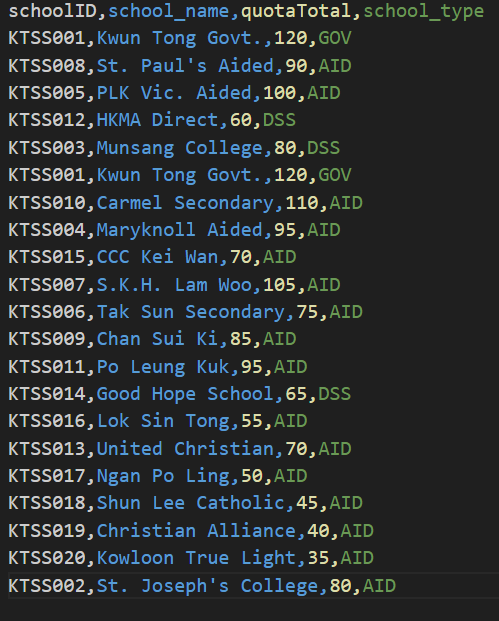
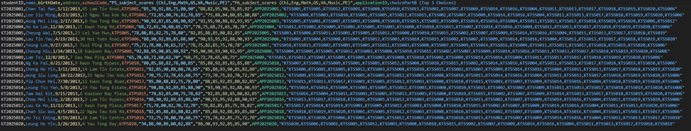
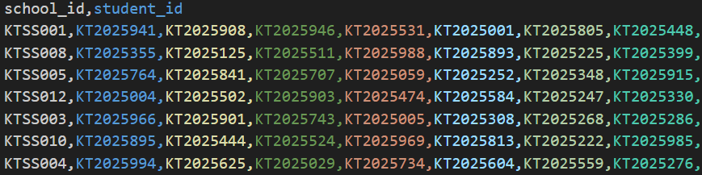
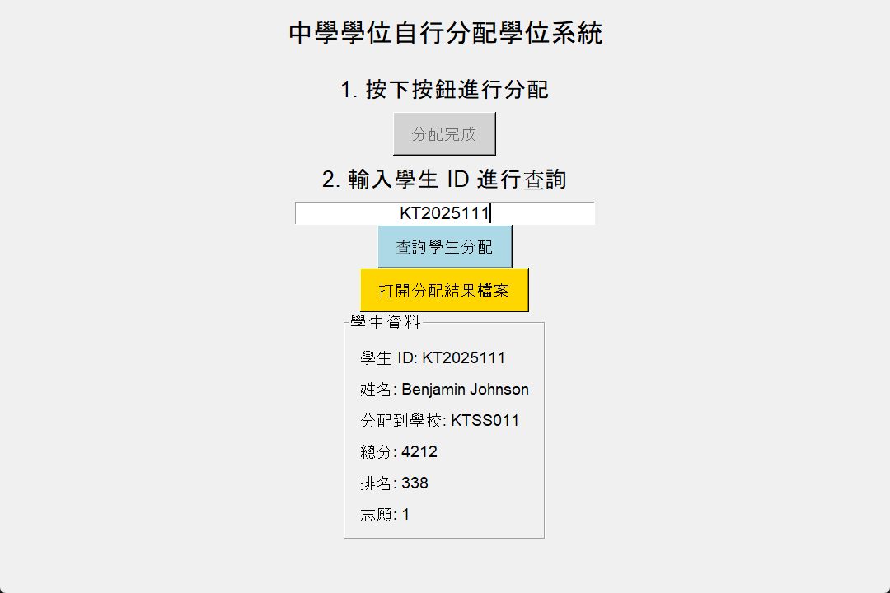

# 香港中學文憑試 資訊及科技通訊科 校本評核 (課業一)

## 目錄

- [1. 主題及介紹內容](#1-主題及介紹內容)
- [2. 數據輸入/輸出](#2-數據輸入輸出)
- [3. 選擇數據類型和數據結構](#3-選擇數據類型和數據結構)
- [4. 流程圖](#4-流程圖)
- [5. 模組設計與程式碼](#5-模組設計與程式碼)
- [6. 使用須知](#6-使用須知)
- [7. 參考文件](#7-參考文件)

---

## 1. 主題及介紹內容

### 現時的升學制度
現行的小一入學機制分為「自行分配學位」及「統一派位」兩個階段。
*   **自行分配學位**：利用面試、筆試等制度，為其子女向中學申請入學。
*   **統一派位**：利用按學生的派位組别、家長選校意願及隨機號分配學位。

> **注意**：本校本評核作業僅討論「統一派位」的部分。

**呈分試機制**：
電腦會將全港學生經調整後的分數按高低排列次序，然後平均劃分為 3 個全港派位組別 (Banding)，每個組別佔全港學生人數的三分之一。隨機編號用以決定同一派位組別學生獲分配學位的先後次序。

| 科目 | 呈分試試卷分數 | 呈分試比重 | 呈分試成績分數 |
| :--- | :--- | :--- | :--- |
| 中文 | 100 | 9 | 900 |
| 英文 | 100 | 9 | 900 |
| 數學 | 100 | 9 | 900 |
| 常識 | 100 | 6 | 600 |
| 視藝 | 100 | 3 | 300 |
| 音樂 | 100 | 2 | 200 |
| 體育 | 100 | 2 | 200 |

### 現行制度分析
*   **優點**：
    *   提供相對公平的競爭環境，標準統一。
    *   選校過程透明，家長能了解學校質素。
*   **缺點**：
    *   排名較後的學校可能面臨收生不足（殺校危機）。
    *   各小學試卷難度不一，難以完全公平。

### 新元素加入
利用 Python 內建函式庫 **Tkinter**，提供圖形使用者界面 (GUI) 方便用戶使用，取代傳統的命令行操作。

### 使用方法與規則
1.  **準備檔案**：用戶需準備 `school.csv` (學校資料) 和 `students.csv` (學生資料)。
2.  **數據格式**：
    *   `school.csv`: 學校ID, 名稱, 學額, 類型...
    *   `students.csv`: 學生ID, 姓名, 成績(P5/P6), 志願...
3.  **執行分配**：將數據檔與程式置於同一目錄，啟動程式進行運算。
4.  **查看結果**：系統將生成 `assign.csv` 並可在 GUI 中查詢個別結果。

---

## 2. 數據輸入/輸出

### 預期輸入數據 (Input Data)

**1. 學校資料檔案 (`school.csv`)**


**2. 學生資料檔案 (`students.csv`)**


### 預期輸出結果 (Output Data)

**1. 分配結果檔案 (`assign.csv`)**


**2. 系統圖形界面 (GUI)**


---

## 3. 選擇數據類型和數據結構

| 變數名稱 | 類型 | 用途描述 |
| :--- | :--- | :--- |
| `school_quota` | 二維陣列 (List) | 存儲學校 ID 和限額 `[school_id, quota]` |
| `students_data` | 字典 (Dictionary) | **核心數據庫**。鍵為學生 ID，值為包含姓名、成績、志願的字典 |
| `assign` | 列表 (List) | 臨時存儲按總分排序後的學生 ID |
| `band1` / `2` / `3` | 列表 (List) | 分別存儲前、中、後 1/3 排名的學生 ID |
| `school_assign_list` | 字典 (Dictionary) | 存儲分配結果。鍵為學校 ID，值為獲派學生 ID 列表 |
| `school_quota_left` | 二維陣列 (List) | 跟蹤分配過程中的學校剩餘學額 |
| `total_score` | 整數 (Integer) | 經加權計算後的學生總分 |

### 數據有效性檢驗 (Validation)
1.  **範圍檢查 (Range Check)**：檢查 P5/P6 成績是否在 0-100 之間。
2.  **完整性檢查 (Integrity Check)**：檢查 `school.csv` 及 `students.csv` 是否存在。
3.  **存在性檢查 (Existence Check)**：檢查學生選填的學校 ID 是否在學校名單內。
4.  **格式檢查 (Format Check)**：確保 CSV 欄位符合系統要求。

---

## 4. 流程圖

下圖展示了系統由數據輸入、處理（計算、排序、隨機化、分配）到輸出的完整邏輯：


---

## 5. 模組設計與程式碼

以下列出系統的核心功能模組及其 Python 實作邏輯。

### 5.1 數據輸入模組 (`input_data`)

負責讀取 CSV 檔案並轉換為 Python 列表或字典。

```python
def input_school_data():
    if school_file_path == "":
        raise FileNotFoundError("學校資料檔案未選擇")
    # ... (讀取檔案並存入 school_quota)
    print("學校資料讀取完成\n")

def input_student_data():
    # ... (讀取檔案，轉換成績為 int，存入 students_data 字典)
    print("學生資料讀取完成\n")
```

### 5.2 數據驗證模組 (`verify_data`)

利用雙層迴圈 (Nested Loop) 檢查所有學生的志願學校是否存在，以及成績是否合法。

```python
def verify_data():
    print("驗證學校 ID 及 分數範圍...")
    # ... (邏輯判斷)
    if has_error:
        return False
    return True
```

### 5.3 成績計算與排序 (`calculate_score`)

根據教育局比重計算總分，並使用 **選擇排序 (Selection Sort)** 或 Python 內建排序將學生按分數高低排列。

```python
def calculate_score():
    # ... (加權計算: 中英數x9, 常識x6 等)
    # 排序邏輯
    student_scores.sort(key=lambda x: x[1], reverse=True)
    print("排序完成\n")
```

### 5.4 學生組別劃分 (`assign_student`)

將已排序的學生平均分配到 Band 1, Band 2, Band 3。

```python
def assign_student():
    total = len(assign)
    # ... (利用切片或迴圈將學生分流至不同 Band 列表)
    print("學生分配完成\n")
```

### 5.5 學校分配核心算法 (`assign_school`)

模擬「隨機編號」與「志願優先」機制。
1.  使用 `random.shuffle` 打亂同 Band 學生順序。
2.  依序處理每個學生的志願，若首志願額滿則嘗試下一志願。

```python
def assign_school():
    random.shuffle(band1) # 模擬隨機編號
    # ... (處理 Band 1, 2, 3)
    
    def process_band(band):
        # ... (佇列處理邏輯：有位則入，無位則下一志願重排)
```

### 5.6 查詢與介面 (`GUI`)

使用 `Tkinter` 構建圖形介面，提供檔案選擇、執行分配及結果查詢功能。

```python
# GUI 構建片段
top = tk.Tk()
top.title("中學學位自行分配學位系統")
# ... (Button, Label, Entry 定義)
top.mainloop()
```

---

## 6. 使用須知

### 系統依賴 (Dependencies)
本系統僅使用 Python 標準庫，無需安裝額外套件：
*   `tkinter`: 圖形介面
*   `random`: 隨機編號模擬
*   `csv` / `os`: 檔案處理

### 建議配置
*   **Python 版本**: 3.9 或以上
*   **操作系統**: Windows 10/11, macOS, Linux
*   **記憶體**: 512MB 以上

---

## 7. 參考文件

### 書籍
1.  一域出版有限公司（2022）：《明德資訊及通訊科技 D1 計算思維與程式編寫》。
2.  一域出版有限公司（2022）：《明德資訊及通訊科技 選修部分 C 算法與程式編寫》。

### 互聯網資源
*   **香港教育局**：[中學學位分配辦法簡介](https://www.edb.gov.hk/attachment/tc/edu-system/primary-secondary/spa-systems/secondary-spa/general-info/SSPA_2025_leaflet_TC.pdf)
*   **Python 文檔**:
    *   [Tkinter GUI 教學 (Runnoob)](https://www.runoob.com/python/python-gui-tkinter.html)
    *   [Python Dictionaries (W3Schools)](https://www.w3schools.com/python/python_dictionaries_nested.asp)
    *   [Steam 教育學習網 - Tkinter](https://steam.oxxostudio.tw/category/python/tkinter/start.html)

### 人工智能工具聲明
*   **工具**: Microsoft Copilot
*   **用途**: 查詢 Tkinter `command` 屬性中 `lambda` 函數的使用方法，以解決按鈕回調函數帶參數的問題。


